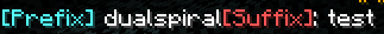

## Default Chat Format

By default, if the Nucleus chat module is enabled, Nucleus will format player chat messages in the following way:

```
prefix name suffix: message
```

The default template will thus return something like this:



The prefix and suffix are set from the `prefix` and `suffix` options via your permission plugin. For example, to set
the prefix based on group with the default settings, run:



## Modifying the Chat Format 

### Player Name/Chat Colours

To give the player's name, or their chat, a default display colour, the "namecolour" and "chatcolour" permission options
can be set. To give all mods dark purple names, a permission command you might use is: 



Similarly, for light blue chat text for the admin group:



The supplied colours are the standard Minecraft formatting codes.

### Player Name/Chat Styles

Styles can also be set for the name and chat messages, using the "namestyle" and "chatstyle" permission options.
These permission options can accept multiple styles which are comma separated. Both single character and named
styles are accepted. To set the style as bold and italic, set the `chatstyle` option to `l,o` or `bold,italic`.

If you were to add the italic and bold styles to the mod group, an example command to run would be:

  

or, for their name



The supplied styles are the standard Minecraft formatting codes.

### Customising Chat Formats

Nucleus enables rich customisation of chat formatting. The default template can be found at `chat.templates.default`,
where the `prefix` key represents what appears before a message, and suffix representing what appears after.

[The various default tokens that can be used in the format can be found here.](../links-and-tokens.html). Other plugins
may add additional tokens. 

### Adding Multiple Prefixes

Nucleus can render _any_ permission option in the chat format. This can be useful if you have multiple permission tracks
and want to show a prefix for each one - potentially saving server owners from creating multiple group templates. The chat
token `{{o:[option]}}`, where `[option]` is defined on permission groups.

If you wish to display a permission option named "prefix2", for example, add `{{o:prefix2}}` to the template in the
prefix or suffix config option in the relevant `chat.templates` entry. If the option doesn't exist on a player's group,
nothing will be displayed.

### Group Templates

For more complex customisations based on player group, Nucleus offers the ability to define alternative templates, in
the `chat.templates.group-templates` config map. Templates can be defined with a group name specified as the key.

> Unlike Essentials and Nucleus v1, Nucleus v2 reads the text in the permission option `nucleus.chat.group` 
> to determine which group a player belongs in.  
{:.bl.warn}

If the permission option `nucleus.chat.group` for a player is not empty, Nucleus will try to read the template named
the same as the option. That is, if the option value is "hello" for a player, Nucleus will try to read the template from 
`chat.templates.group-templates.hello` when that player sends a message, falling back to the default.

An example command to make the "mod" group use the "modtemplate" template would be:



## Troubleshooting

There are a few reasons why Nucleus chat formatting may not be showing.

* The Chat module must be enabled.
* The configuration option `modify-chat` must be `true`.
* Unexpected prefixes and suffixes may be removing by setting the `overwrite-` configuration options. 
* The Nucleus Chat formatting may be overwritten by other mods or plugins. [Check the compatibility tab on the chat module](../modules/chat.html#compatibility) any for known plugin incompatibilities.

