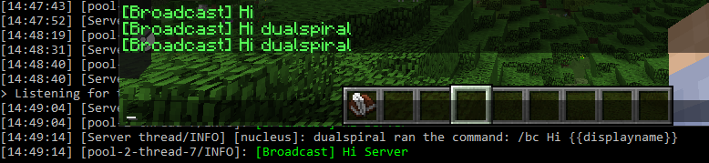

## Introduction

The Notifications Module supports broadcasting, titles and action bar messages. 
## `/broadcast` customisation

The `/broadcast` message is prefixed and suffixed by the message templates defined at `broadcast-message-template.prefix` and `broadcast-message-template.suffix`. 
They work the same way as the chat module templates do, please see the [Chat Module](chat.html) documentation for more information on creating the templates.

`/plainbroadcast` does not use these prefixes/suffixes.

## `/basictitle`, `/basicsubtitle` and `/basicactionbar`

These commands allow for the use of ampersand encoded strings. They also accept the following flags:

* `-p [player]`: The name of the player or a selector that defines who to send the message to. If omitted, sends to all on the server.
* `-i [seconds]`: The amount of time taken by the fade in effect, in seconds (does not affect action bar messages).
* `-o [seconds]`: The amount of time taken by the fade out effect, in seconds.
* `-t [seconds]`: The amount of time taken the message remains on the screen, in seconds.

## Tokens in notifications.


Adding a token (such as `{{displayname}}` or `{{name}}` to the message will now show each player a personalised message - the tokens will be parsed based on each player rather than the sender. The sender's name is accessible through the `{{sender}}` token.


This does not affect how the tokens for the prefix/suffix work - they will still be based on the sender.

For the list of tokens available for use by default, [please see this page](../links-and-tokens.html)