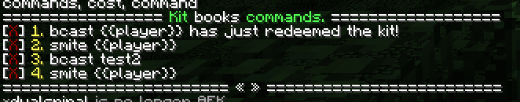

## Commands in Kits

### Viewing the commands in a kit

> This requires you have the permission `nucleus.kit.command.base`

`/kit command <kit>` lists the commands, and if you have permission to remove commands, they can be removed from this list too.

### Adding a command

> Be VERY careful when allowing players to add commands to kits. Any command added to kits will be run as the SERVER, not
> the player. Such permissions can be misused and allow a rogue staff member to take over your server. 
{:.bl.error}

> This requires you have the permission `nucleus.kit.command.add.base`.


The command to add a command to a kit is `/kit command add <kit> <command>`, where the command should not start with a `/`, and anywhere you want to substitute the player's name, you should add `{{player}}`. 

So, to broadcast a player's name, you could write: `broadcast {{player}} just opened a kit`, and this would broadcast `dualspiral just opened a kit` if dualspiral opened the kit. Similarly, if you wanted to smite someone who opened a kit, then you'd use `smite {{player}}`, etc.


### Removing and clearing commands

> This requires you have the permission `nucleus.kit.command.remove.base`.

To remove commands: `/kit command remove <kit> <command|index from list>`
To remove all commands: `/kit command clear`

We would normally recommend using the list to remove commands, but you can also type the full command to remove or use the (one-based) index from the `/kit command` list.
