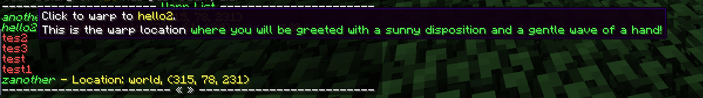

## Warp Categories

Warps can be organised into categories in `/warps` to make things more manageable when you have many warps. However,
this must be turned on in the configuration if you wish to use it.

### Enabling Warp Categories

In `main.conf`, in the `warp` section, set `list-warps-by-category` to `true`.

> If you are editing the configuration while the server is running, be sure to run `/nucleus reload` to pick up the configuration change.

### Setting Warp Categories

To set a category for a warp, you can use the command:

`/warp setcategory [-n] [-r] <warp> [<category>]`

where `<warp>` is the name of the warp and `<category>` is the name of the category to set (if you are not removing a category).
The category is alphanumeric, but a display name can be set for the category, which will be covered in the next section.

There are two flags that you may need to add to your command.

* `-n` indicates that you want to add a new category to the list, if you don't use this flag and the category doesn't exist yet, you'll 
be prompted to add this flag to confirm the creation.
* `-r` indicates you want to remove the category from the warp.

## Adding descriptions for warps and warp categories

Warp categories can have descriptions and display names, which also accept colour codes. They will be displayed on the 
`/warps` list, and can be managed using the following commands.

* `/warp category list` - lists all categories
* `/warp category setdisplayname [category] [& encoded name]` - sets a display name for a category.
* `/warp category setdescription [category] [& encoded description]` - sets a description for a category.
* `/warp category removedisplayname [category]` - removes the display name for a category.
* `/warp category removedescription [category]` - removes the description for a category.

Running the following commands for a category named "test":

* `/warp category setdisplayname test "&4Test &7Category"`
* `/warp category setdescription test "&bThis is a &ltest description"`

gives the following.

Warps can also have their own description, but for space reasons, these descriptions will be put into the hover that 
appears when you hover over a warp link. They can be set using the following command (or use `-r` to remove the description):

* `/warp setdescription [-r] [warp] [& encoded description]`

So, on warp "hello2", running the command 
`/warp setdescription hello2 "This is the warp location &awhere you will be greeted with a sunny disposition and a gentle wave of a hand!"` 
gives the result:

If you would rather put the description in the main menu, and have the cost/location appear in the tooltip, set 
`show-warp-description-in-list` to `true` in the `warp` section of `main.conf`.
